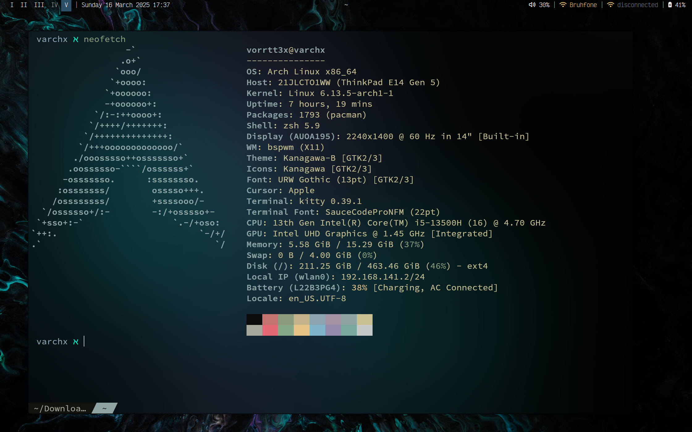

# Dotfiles

> This repo auto-commits using a cronjob running `auto.sh`. So if you see a weird commit message, its not me:D

### Spec

    - Arch
    - bspwm
    - picom
    - kitty
    - neovim
    - polybar
    - tmux
    - and a few others

> This config is managed by GNU Stow!
